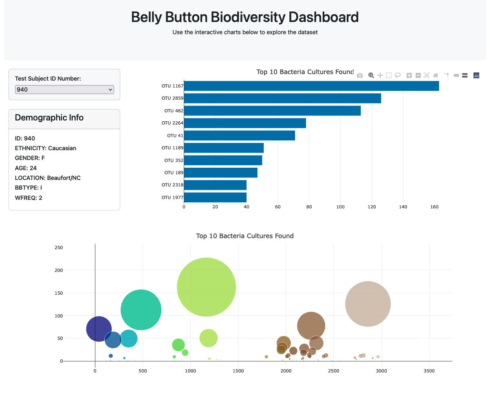

# Belly-Button-Challenge #

## Project Overview:
- Building an interactive dashboard to explore the <a href="http://robdunnlab.com/projects/belly-button-biodiversity/" target="_blank">Belly Button Biodiversity dataset</a>, which catalogs the microbes that colonize human navels.
- The dataset reveals that a small handful of microbial species (also called operational taxonomic units, or OTUs, in the study) were present in more than 70% of people, while the rest were relatively rare.

## Application:
- Built a function to fetch a sample metadata from JSON file.
- Filtered the data with D3 library for the specific samples.
- Populated the new tags for each key-value in the filtered metadata.
------------------------------------------------------------------------------
- Built a function to fetch a sample metadata from JSON file.
- Filtered for the chosen sample based on user selection.
- Obtained relevant data points (OTU IDs, labels, and sample values).
- Created bubble chart and bar chart.
------------------------------------------------------------------------------
- Extracted sample names from the JSON file.
- Generated a dropdown menu with available sample names for user.
- Got the first sample and built charts and metadata panel.
------------------------------------------------------------------------------
- Built a function to generate charts and metadata panel each time a new sample is selected.
- Finally initialize the dashboard.

## Application link:
- <a href="https://chuckerol.github.io/belly-button-challenge/" target="_blank">chuckerol.github.io/belly-button-challenge</a>

## Sources:
- I found some of my codes from previous class activities.
- I ask some questions to my classmates in Slack and during our study group meeting.
- I found some helpful information with watching various YouTube videos.
- I found some information from StackOverFlow website.

